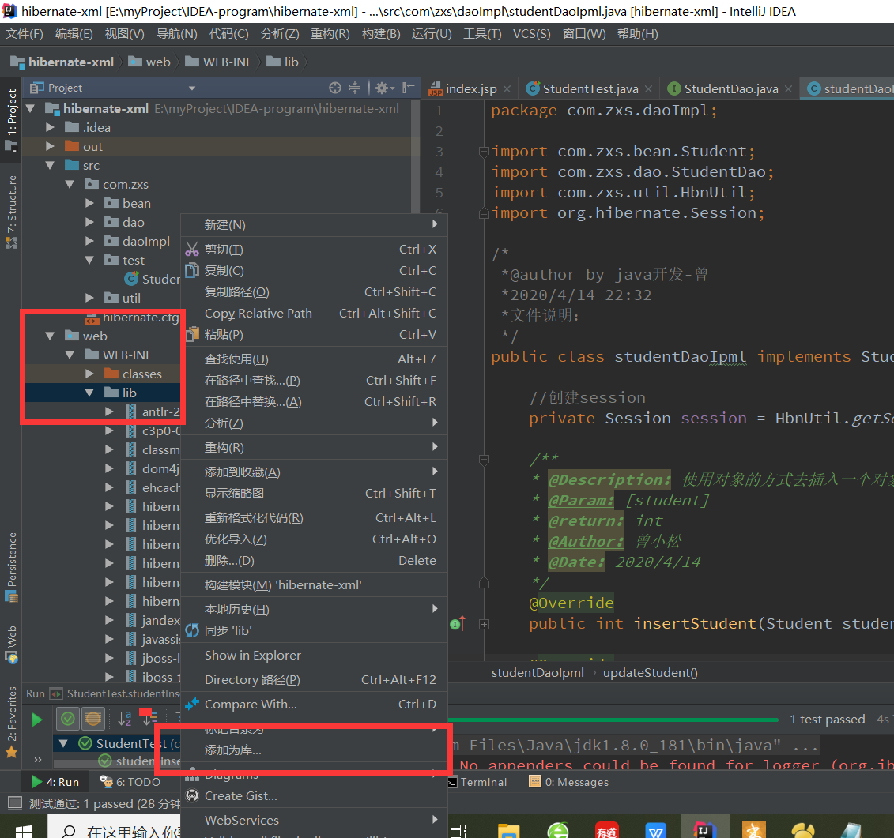
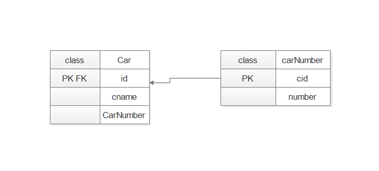

# hibernate-xml
---

>这里我们讲讲以xml配置文件的方式来搭建hibernate框架

## 入门-简单配置  

> 引入所需要的jar包 [点击这里，就能去我的github上下载所需要的jar包](https://github.com/zengxiaosong/javaRepository)  

下载好jar包之后，将这些包复制到我们的项目中的==lib==文件中，（如何搭建web项目我们前面已经讲过，自己去看）    

> 提示：如果引入的jar包不能正常使用，右击==lib==  \>添加为库。  



> 接下来就是去配置我们的 ***hibernate.cfg.xml***  在我们的src目录下新建hibernate.cfg.xml,具体配置的文件内容如下：  

``` xml
<?xml version="1.0" encoding="UTF-8"?>
<!DOCTYPE hibernate-configuration PUBLIC
        "-//Hibernate/Hibernate Configuration DTD 3.0//EN"
        "http://www.hibernate.org/dtd/hibernate-configuration-3.0.dtd">

<hibernate-configuration>
    <session-factory>
        <!--定义数据库链接四要素 根据数据库的需要进行自己选择驱动 -->
        <property name="hibernate.connection.driver_class">com.mysql.jdbc.Driver</property>
        <property name="hibernate.connection.username">root</property>
        <property name="hibernate.connection.password">123456</property>
        <!--链接到我的数据库-->
        <property name="hibernate.connection.url">jdbc:mysql://127.0.0.1:3306/hibernate_test</property>

        <!-- 定义方言 -->
        <property name="dialect">org.hibernate.dialect.MySQL57Dialect</property>

        <!-- 定义C3PO连接池 -->
        <property name="hibernate.connection.provider_class">org.hibernate.c3p0.internal.C3P0ConnectionProvider</property>


        <!-- 注册上下文 -->
        <property name="hibernate.current_session_context_class">thread</property>

        <!-- 配置数据库自动创建表和显示sql -->
        <property name="hibernate.hbm2ddl.auto">update</property>
        <property name="hibernate.show_sql">true</property>
        <property name="hibernate.format_sql">true</property>

        <!-- 定义mapping文件  根据数目自行定义-->
        <mapping resource="com/zxs/bean/student.hbm.xml" />


    </session-factory>
</hibernate-configuration>
```  
> 上面代码中，我是使用的mysql数据库，使用什么数据库就看你自己的习惯了，从我们上面的代码中，我们应该知道，接下来就应该去配置我们的  ***student.hbm.xml*** 文件。以及配置我们的 ***bean /Student***  来看代码吧：  

``` student.hbm.xml
<?xml version="1.0" encoding="UTF-8"?>
<!DOCTYPE hibernate-mapping PUBLIC
        "-//Hibernate/Hibernate Mapping DTD 3.0//EN"
        "http://www.hibernate.org/dtd/hibernate-mapping-3.0.dtd">

<hibernate-mapping>
    <!-- hbm配置文件的作用是
    	（1）映射类和表
    	（2）映射属性和字段
     -->
    <class name="com.zxs.bean.Student" table="user_table">
        <id name="id" column="id">
            <!-- native由Hibernate根据底层数据库自行判断采用identity、hilo、sequence其中一种作为主键生成方式,
                 这种方式我在开法过程中经常用到，意思是把主键的生成方式交给底层数据库来决定。-->
            <generator class="native"/>
        </id>
        <property name="name" column="name"/>
        <property name="sex" column="sex"/>
        <property name="age" column="age"/>
        <property name="score" column="score"/>
    </class>

</hibernate-mapping>
```  
> 注意看代码，在class里面对应着我们的javabean,右边对应着我们的数据举重表的信息。接下来就是创建bean。  

``` java
package com.zxs.bean;

/*
 *@author by java开发-曾
 *2020/4/14 21:59
 *文件说明：
 */
public class Student {
    private Integer id;
    private String name;
    private String sex;
    private Integer age;
    private String score;

    public Student() {
    }

    public Student(String name, String sex, Integer age, String score) {
        this.name = name;
        this.sex = sex;
        this.age = age;
        this.score = score;
    }

    public Integer getId() {
        return id;
    }

    public void setId(Integer id) {
        this.id = id;
    }

    public String getName() {
        return name;
    }

    public void setName(String name) {
        this.name = name;
    }

    public String getSex() {
        return sex;
    }

    public void setSex(String sex) {
        this.sex = sex;
    }

    public Integer getAge() {
        return age;
    }

    public void setAge(Integer age) {
        this.age = age;
    }

    public String getScore() {
        return score;
    }

    public void setScore(String score) {
        this.score = score;
    }

    @Override
    public String toString() {
        return "Student{" +
                "id=" + id +
                ", name='" + name + '\'' +
                ", sex='" + sex + '\'' +
                ", age=" + age +
                ", score='" + score + '\'' +
                '}';
    }
}

```  
> 接下来就是创建我们的测试文件了，创建一个测试包，在里面写如下代码：  

``` java
    @Test
    public void studentTest(){
        
		//加载hibernate.cfg.xml配置文件
        Configuration configuration = new Configuration().configure();
		//建立session工厂，
        SessionFactory sessionFactory =configuration.buildSessionFactory();
		//建立session
        Session session =sessionFactory.getCurrentSession();

        try {
		    //开启事物
            session.beginTransaction();
            Student student =new Student("小明", "男",25,"95.5");
            session.save(student);
            session.getTransaction().commit();
        }catch (Exception e){
            e.printStackTrace();
			//失败的话，对事物进行回滚。
            session.getTransaction().rollback();;
        }
    }
```  
> 点击运行，查看数据库，基本的操作我们是做完了，接下来还是讲讲原理吧，可能说部分同学不知道是怎么出来的。

## hibernate基本原理    
---

> 1.先讲下ORM的概念，（Object-Relation Map）即对象关系映射  

我们常见的数据库如NoSql下的Redis，和我们的关系数据库。甚至是表和文件等，当然，这里我主要讲讲 ***关系数据库*** 。关系数据一般来讲是以表来做设计的，对于一个表，我们可以看做是一个类，每行对应的所有列，可以看做是一个类对应的每个对象的所有属性。因为Java是面向对象做设计的。  

>  2.基本流程是怎么回事呢？  

首先用户要访问数据库中的某个表 ，但是我们是对象，然后通过hibernate框架作为中间件对数据库DB进行访问。那么这个中间过程是怎么实现的呢？  首先就是通过  ```hibernate.cfg.xml``` 对我们的数据库进行连接与配置。并配置我们有哪些对象要去做这样的操作呢，所以就有我们的 ```<mapping reasource= "----" />``` 在我们的 ```bean``` 层里面用上面讲到的```student.hbm.xml``` 对我们的bean进行一对一配置连接。这样，我们的基本配置就完成了，那怎么来操作呢？上面的 ```test``` 代码我已经做了详细的讲解了。  

> 3.session的三种状态。  

从上面的test例子中，我们可以看出，最终是我们的```session```在操作数据,那session的运行是怎么进行的呢？   

Session相关联，其有3种状态：临时状态（transient）：对象在内存中孤立存在，不与数据库中的数据有任何关系，持久化状态（persistent）：对象与一个session相关联，则从临时状态变为持久化状态，游离状态（detached）：Session关闭，对象进入游离状态。当然，这里还是希望读者大致去了解下数据库连接池，这里用的c3p0连接池。  

> 4.openSession()和getCurrentSession()的异同   （总的来说一般多用后者）

 1. 数据共享  
 
openSession每次返回一个新的session，无法实现共享数据，getCurrentSsession返回一个threadLocalSessionContext对象，该对象与当前访问的thread有关，如果thread不变，则session不变。在thread首次访问时创建，故同一个thread的不同请求之间共享session，可以实现数据共享。  

2. 关闭    

openSession需要手动关闭，getCurrentSsession无需手动关闭  

3. 使用方便  

openSession无需注册，直接使用，getCurrentSsession需要在XML中进行上下文注册  

4. 数据操作  

openSession的查询操作可以在事务外进行，增删改在事务内进行，getCurrentSsession的增删改查都需要在事务内进行，使用getCurrentSession必须在配置文件中注册上下文      

> 5. session的建立   

注意：SessionFactory非常占用系统资源，并且是多线程的，故做成单例对象（只创建一次），不进行手动关闭    当我们需要使用的时候，通过  ``` getSession()```方法去获取就行。   

```
public class HbnUtil {

    //静态属性，session工厂，静态属于全局
    private static SessionFactory sessionFactory;

    /**
    * @Description:  返回session
    * @Param: []
    * @return: org.hibernate.Session
    * @Author: 曾小松
    * @Date: 2020/4/14
    */
    public static Session getSession(){
        return getSessionFactory().getCurrentSession();
    }

    /**
    * @Description:  私有方法，创建工厂
    * @Param: []
    * @return: org.hibernate.SessionFactory
    * @Author: 曾小松
    * @Date: 2020/4/14
    */
    private  static SessionFactory getSessionFactory(){
        if (sessionFactory == null || sessionFactory.isClosed()){
            //如果没有工厂，就从配置文件中去创建一个
            sessionFactory = new Configuration().configure().buildSessionFactory();
        }
        return sessionFactory;
    }

}

```

##    hibernate数据关联  
---

> 所谓的关联是什么意思呢？我们知道在数据库的表中存在外键的关联关系。以及一些其他的属性，既然我们用此框架来进行连接，那么我们这里的java层面也就应该存在这样的关联关系。即作为实体的bean之间的关联。  

###  一对一关联    


Hibernate针对一对一的关联关系提供了两种映射方法：
1. 按照主键映射：这种映射方式要求两个数据表以主键相关联，即其中一个表的ID字段既是主键又是外键，两个表共享主键。
2. 按照外键映射：这种映射方式要求以一个表中主键关联另一个表中外键，即一个表中的外键参照另一个表的主键。

怎么来实现呢？我们先来看看主键关联的实现，下面我们使用汽车类和汽车号牌类来演示下，让汽车号牌的id作为主键，同时又是外键。（因为我们是先有汽车，再有汽车号牌，所以要在号牌类上面去关联汽车类）

    

**car的bean和xml配置文件**

```
public class Car {
    private Integer id;
    private String cname;
    private CarNumber carNumber;

    public Car() {
    }

    public Car( String cname, CarNumber carNumber) {
        this.cname = cname;
        this.carNumber = carNumber;
    }

    public void setCname(String cname) {
        this.cname = cname;
    }

    public void setCarNumber(CarNumber carNumber) {
        this.carNumber = carNumber;
    }

    public Integer getId() {
        return id;
    }

    public String getCname() {
        return cname;
    }

    public void setId(Integer id) {
        this.id = id;
    }

    public CarNumber getCarNumber() {
        return carNumber;
    }

    @Override
    public String toString() {
        return "Car{" +
                "id=" + id +
                ", cname='" + cname + '\'' +
                ", carNumber=" + carNumber +
                '}';
    }
}

//配置文件  

<hibernate-mapping>
    <!-- hbm配置文件的作用是
    	（1）映射类和表
    	（2）映射属性和字段
     -->
    <class name="com.zxs.bean.Car" table="car">
        <id name="id" column="id">
            <!--主键的生成策略是以carNumber 的主键作为本表的外键，id在本表中既是主键，同时又是外键-->
           <generator class="foreign">
               <param name="property">carNumber</param>
           </generator>
        </id>
        <property name="cname" column="t_cname" />
        <!--关联表在本表中能够显示-->
        <one-to-one name="carNumber" class="com.zxs.bean.CarNumber" cascade="all" constrained="true" />
    </class>

</hibernate-mapping>

```  
**CarNumber的bean和xml配置文件**

```
public class CarNumber {
    private Integer cid;
    private String number;

    public CarNumber() {
    }

    public void setCid(Integer cid) {
        this.cid = cid;
    }

    public CarNumber(String number) {
        this.number = number;
    }

    public void setNumber(String number) {
        this.number = number;
    }

    public Integer getCid() {
        return cid;
    }

    public String getNumber() {
        return number;
    }

    @Override
    public String toString() {
        return "CarNumber{" +
                "cid=" + cid +
                ", number='" + number + '\'' +
                '}';
    }
}  
//配置文件

<hibernate-mapping>
    <!-- hbm配置文件的作用是
    	（1）映射类和表
    	（2）映射属性和字段
     -->
    <class name="com.zxs.bean.CarNumber" table="car_number">
        <id name="cid" column="t_id">
            <generator class="native"/>
        </id>
        <property name="number" column="t_number"/>
    </class>

</hibernate-mapping>

```
**两个类的dao层**

```
public interface CarDao {
    public int insertCar(Car car);
}

public interface CarNumberDao {
    public int insertCarNumber(CarNumber carNumber);
}
```
**两个类的daoImpl层**  

```
public class CarDaoImpl implements CarDao {

    private Session session = HbnUtil.getSession();
    @Override
    public int insertCar(Car car) {
        try {
            session.beginTransaction();
            session.save(car);
            session.getTransaction().commit();
            return 1;
        }catch (Exception e){
            e.printStackTrace();
            session.getTransaction().rollback();
        }
        return 0;
    }
}

public class CarNumberDaoImpl implements CarNumberDao {

    private Session session = HbnUtil.getSession();

    @Override
    public int insertCarNumber(CarNumber carNumber) {
        try {
            session.beginTransaction();
            session.save(carNumber);
            session.getTransaction().commit();
            return 2;
        } catch (Exception e) {
            e.printStackTrace();
            session.getTransaction().rollback();
            return 0;

        }
    }

}

```
**测试代码**    

```
@Test
    public void  insertCarTest(){
        CarNumber carNumber = new CarNumber("521314");
//        CarNumberDao carNumberDao = new CarNumberDaoImpl();
//        int m = carNumberDao.insertCarNumber(carNumber);
        Car car = new Car("本田",carNumber);
        CarDao carDao = new CarDaoImpl();
        int m = carDao.insertCar(car);
        System.out.println("插入车牌：m = "+ m);

    }
```  
**总结与值得注意的地方**    

我们在做测试的时候并未向数据库中新建表，而是将新建表的任务交给了hibernate来处理。hibernate会帮助我们在数据库中去新建表，并填充数据，这是因为我们在```hibernate.cfg.xml```中配置了属性``` <property name="hibernate.hbm2ddl.auto">update</property>```,这大大减少了我们的工作量。 除了这个，还有一对一关联中的 主键之间的双向关联，外键关联的单向和双向。  

理解了主键关联，这个外键关系非常简单，因为他就是多对一的一个特例，如果多端控制为1个的话，那不就是一对一了吗，这里要注意站的角度问题，多对一重点在多端，如果是一对多的话，重点在一端，一端本来就是1了，就没有所谓的特例了，所以还是要到多端去设置让他唯一，这样就打到了一对一关系，因此上面说的是多对一的一个特例，这样解释应该清楚了。如何设置多端唯一呢，通过一个属性 unique=ture。因此，只需要简单修改```Car```的配置文件就可以了。

```
<hibernate-mapping>
    <!-- hbm配置文件的作用是
    	（1）映射类和表
    	（2）映射属性和字段
     -->
    <class name="com.zxs.bean.Car" table="car">
        <id name="id" column="id">
            <!--主键的生成策略是以carNumber 的主键作为本表的外键，id在本表中既是主键，同时又是外键-->
           <generator class="foreign"/>
        </id>
        <property name="cname" column="t_cname" />
        <!--关联表在本表中能够显示-->
        <many-to-one name="carNumber" class="com.zxs.bean.CarNumber" column="cnid" cascade="all" unique="true" />
    </class>

</hibernate-mapping>
```  
**这里再简介一个关于 constrained="true" 的例子**  
```  
 @Test
    public void Select(){
        Session session = HbnUtil.getSession();
        Car car=null;
        try{
            session.beginTransaction();
            car =  session.get(Car.class,1);
            //只会查第一个表
            System.out.println(car);
            //这里主要针对constrained="true"的一个测试。
            //System.out.println(car.getCarNumber().getNumber());
            session.getTransaction().commit();

        }catch (Exception e){
            e.printStackTrace();
            session.getTransaction().rollback();
        }
        //session已经关闭，不能再继续查询
       // System.out.println(car.getCarNumber().getNumber());
    }

```
**关于constrianed的理解**
constrained（约束） 
可选, 表明该类对应的数据库表，和被关联的对象所对应的数据库表之间，通过一个外键引用对主键进行约束
只能在one-to-one的映射中使用，（一般放在外键表中）默认值为false（无外键关系）  
该选项最关键的是影响save()和delete()在级联执行时的先后顺序
例如增加的时候，如果constainted=“true”,则会先增加关联表，然后增加本表。 删除的时候反之。
one-to-one的单向关联中，如果constrained=false，则会在查询时就全部取出来，用left outer join的方式。如果constrained=true，hibernate即会延迟加载sql，只把主表的查出来，等有用到关联表的再发sql取。
one-to-one的双向关联中，必须设置constrained=true，否则有重复数据读
如2个表user，car；在为false时sql如下
select * from user a left outer join car b on a.id=b.id left outer join on user c on a.id=c.id where a.id=?    

**关于cascade的解释（主要用于一对多的操作，后面再详讲）**  

cascade属性(级联属性)：描述表的级联关系，用于简化插入、更新、删除操作

只要在cascade的源头上插入或是删除，所有cascade的关系就会被自动的插入或是删除

cascade的取值有5种：
none（默认值）: 所有情况下均不进行关联操作。 
save-update: 在执行save/update/saveOrUpdate时进行关联操作
save-update: 在执行save/update/saveOrUpdate时进行关联操作
all: 所有情况下均进行关联操作，即save-update & delete
all-delete-orphan: 当一个节点在对象图中成为孤儿节点时，删除该节点。比如在一个一对多的关系中，Student中有一个books集合包含2个book（book1、book2），当在books集合中删除book1时（例如执行remove()方法），book表里的book1即成为孤儿节点。当执行category.update(),或session.flush()时，hibernate同步缓存和数据库,会把数据库中book1对应的记录删掉也会被删除。

