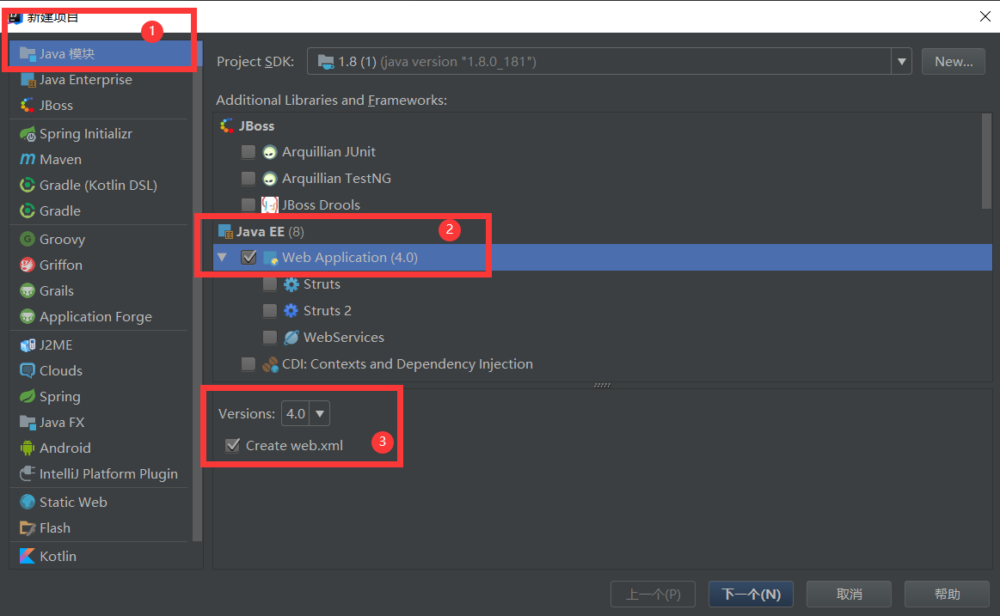

# IDEA搭建基本的网页

> 从目前看来，很多人选择使用IDEA，而不是eclipse,说实在的，真的感觉IDEA确实要比eclipse好用。  

## 1.下载IDEA

IDEA下载哪一个版本，看你自己，不过我这里使用的是IDEA207.3.5这个版本。具体版本之间的差别我还没比较过。  

## 2.新建项目  

> 按照下图做操作就是了，java模块就是要建立一个基本的java项目，jdk是我已经配置好了的，
相信学过Java的人应该明白，然后就是webApplication,既然是web,就肯定有web.xml。  

