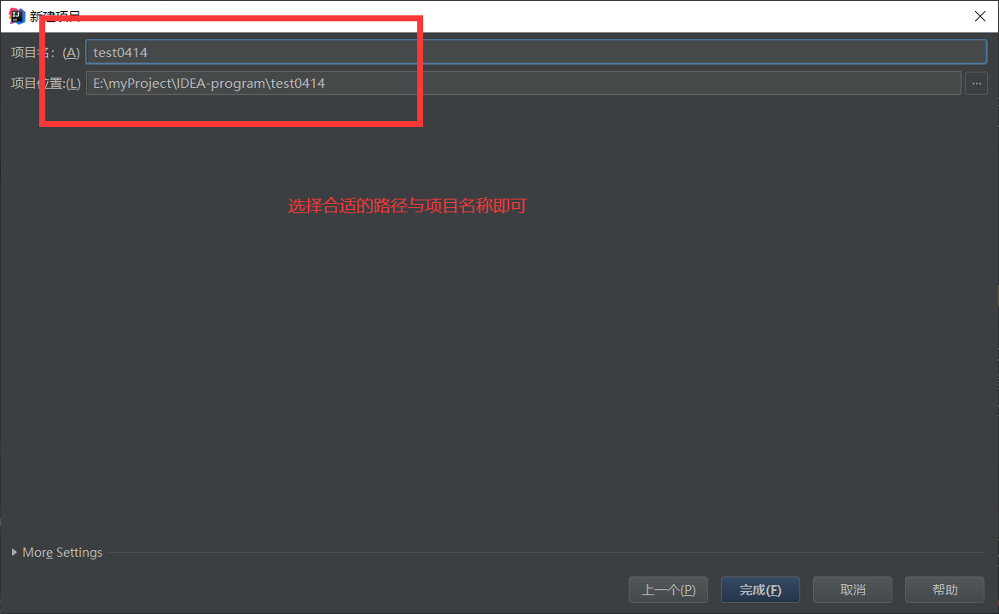
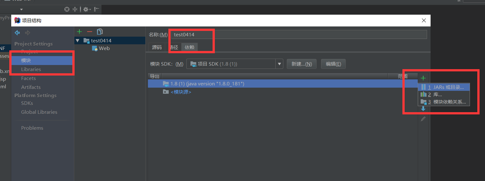

# IDEA搭建基本的网页

> 从目前看来，很多人选择使用IDEA，而不是eclipse,说实在的，真的感觉IDEA确实要比eclipse好用。  

## 1.下载IDEA

IDEA下载哪一个版本，看你自己，不过我这里使用的是IDEA207.3.5这个版本。具体版本之间的差别我还没比较过。  

## 2.新建项目  

> 按照下图做操作就是了，java模块就是要建立一个基本的java项目，jdk是我已经配置好了的，
相信学过Java的人应该明白，然后就是webApplication,既然是web,就肯定有web.xml。  

 

> 点击确定就行，然后你就能看到项目的基本结构了。  

## 3.配置项目  

> 如下图所示，在WEB-INF文件夹下面新建目录 classes和目录 lib。  

具体说明下classes与lib的作用吧：  
&emsp;&emsp;&emsp;classes是项目的编译输出文件。  
&emsp;&emsp;&emsp;lib是项目的依赖库。  
具体怎么来配置和使用，后面我们再逐一讲解。  

    

> 点击左上角文件（file）\> 项目结构（project structure） 进行如下操作。

    
   
     
   
   

> 工作空间和项目的依赖文件位置我们就已经配置好了，应该知道，即使是这样配置好了，没有服务器，   
我们的项目还是不能正常运行，因此，这个时候我们就来配置服务器。按照下面步骤操作吧。  

> 记得每次执行一步都去执行一下应用。  

  
  
  
  
  
   

> 点击应用，确定之后简单的项目就基本配置好了。项目在建立的时候回自动给你新建一个index.jsp, 我们按照下面图片的方法运行一下项目就可以了  
注意一下，在上面我们是用的默认浏览器谷歌来运行的，如果你没有，或者不喜欢，可以换一个，（值得说说明的是，谷歌是标配）。  

   

> 好了，我们的网站基本就搭建好了，接下来，我们就可以在这基础之上做更多的事情了。 

